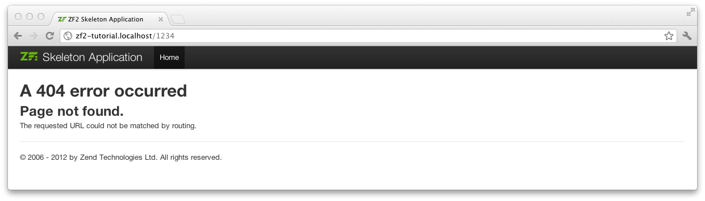

.. _user-guide.skeleton-application:

开始: 一个框架的应用程序
=======================================

为了建立我们的应用程序, 我们将开始
`ZendSkeletonApplication <https://github.com/zendframework/ZendSkeletonApplication>`_ 
在 `github <https://github.com/>`_. 使用 Composer (http://getcomposer.org)
从头开始建立一个使用zend框架的项目:

.. code-block:: bash
   :linenos:

    php composer.phar create-project --stability="dev" zendframework/skeleton-application path/to/install

.. 注意::

    安装 ZendSkeletonApplication 的另一种方法是使用github.  访问 
    https://github.com/zendframework/ZendSkeletonApplication 点击 “Zip”
    按钮. 这将下载一个名为的文件
    ``ZendSkeletonApplication-master.zip`` 或类似的. 

   保证解压这个文件到虚拟主机目录下面之后重命名这个文件为 ``zf2-tutorial``. 

    ZendSkeletonApplication 是使用 Composer (http://getcomposer.org) 来解决他的依赖关系。 这种情况下, 依赖是 Zend Framework 2
    本身.

    为了安装 Zend Framework 2 在我们的应用中:

    .. code-block:: bash
       :linenos:

        php composer.phar self-update
        php composer.phar install

    在 ``zf2-tutorial`` 文件夹中. 这将需要一段时间. 你将会看到一个输出像这样:

    .. code-block:: bash
       :linenos:

        Installing dependencies from lock file
        - Installing zendframework/zendframework (dev-master)
          Cloning 18c8e223f070deb07c17543ed938b54542aa0ed8

        Generating autoload files

.. 注意::

    如果你看到这条消息: 

    .. code-block:: bash
       :linenos:

        [RuntimeException]      
          The process timed out. 

    那么你的连接速度太慢了而不能及时的下载整个安装包, composer
    超时了. 为了避免这种情况, 替代下面命令:

    .. code-block:: bash
       :linenos:

        php composer.phar install

    运行:

    .. code-block:: bash
       :linenos:

        COMPOSER_PROCESS_TIMEOUT=5000 php composer.phar install
        
.. 注意::

   使用wamp的windows的用户:
   
   1. 检查windows下是否正确的安装了composer运行 
      
      .. code-block:: bash
         :linenos:
         
         composer
         
   2. 在windows下安装git. 也需要把git的路径加入到环境变量中之后检查git是否正确安装运行
      
      
      .. code-block:: bash
         :linenos:
         
         git
         
   3. 现在使用命令安装zf2
      
      .. code-block:: bash
         :linenos:
         
         composer create-project -s dev zendframework/skeleton-application path/to/install
   

现在我们可以继续web服务器的设置.

使用 Apache Web Server
---------------------------

现在你要为这个应用创建一个apache虚拟主机文件之后编辑这个文件为了 ``http://zf2-tutorial.localhost`` 这个地址能访问到``zf2-tutorial/public`` 文件夹下的 ``index.php``
.

通常使用 ``httpd.conf`` 或者``extra/httpd-vhosts.conf``来设置虚拟主机文件.  如果你使用 ``httpd-vhosts.conf``, 确保它被主文件 ``httpd.conf`` 包含了. 
一些Linux发行版中 (例: Ubuntu) Apache 的配置文件被存储在 ``/etc/apache2`` 
之后创建每个虚拟主机文件在文件夹下 ``/etc/apache2/sites-enabled``.  这种情况下, 你将放置你的虚拟主机文件在 
``/etc/apache2/sites-enabled/zf2-tutorial``文件夹下.

确保 ``NameVirtualHost`` 已经定义和设置 “\*:80” 或者类似的, 之后定义一个虚拟主机文件像这样:

.. code-block:: apache
   :linenos:

    <VirtualHost *:80>
        ServerName zf2-tutorial.localhost
        DocumentRoot /path/to/zf2-tutorial/public
        SetEnv APPLICATION_ENV "development"
        <Directory /path/to/zf2-tutorial/public>
            DirectoryIndex index.php
            AllowOverride All
            Order allow,deny
            Allow from all
        </Directory>
    </VirtualHost>

确保你已经更新你的 ``/etc/hosts`` 或者
``c:\windows\system32\drivers\etc\hosts`` 文件以便 ``zf2-tutorial.localhost``
映射到 ``127.0.0.1``. 这个网站能够使用``http://zf2-tutorial.localhost``访问到.

.. code-block:: none
   :linenos:

    127.0.0.1               zf2-tutorial.localhost localhost

重启 Apache.

如果你做的正确，他看起来应该是这样的:

.. image:: ../images/user-guide.skeleton-application.hello-world.png
    :width: 940 px

为了测试你的 ``.htaccess`` 文件是否工作, 访问``http://zf2-tutorial.localhost/1234`` 之后你应该看到像这样:

如果你看到一个标准的apache 404错误, 那么你需要再继续之前修改你的 ``.htaccess`` 文件.  如果你正在使用IIS的URL Rewrite 模块, 导入下面的语句:

.. code-block:: apache
   :linenos:

    RewriteCond %{REQUEST_FILENAME} !-f
    RewriteRule ^ index.php [NC,L]

现在你有一个工作中的应用 我们可以为我们的应用程序添加细节.

使用内置的PHP CLI服务
---------------------------------

或者 — 你正在使用PHP5.4以上版本 — 你能够使用内置的CLI服务 (cli-server). 为了做到这点，你只需要在你的根目录下运行:

.. code-block:: bash
    :linenos:
    
    php -S 0.0.0.0:8080 -t public/ public/index.php

这将使网站上的所有网络接口都在8080端口上, 使用``public/index.php`` 来处理路由. 这就意味着网站可以通过 http://localhost:8080
或者 http://<your-local-IP>:8080来访问.

如果你正确的完成了这些, 你应该看到与Apache相同的结果.

为了测试路由是否工作, 访问
http://localhost:8080/1234 你应该看到与Apache相同的错误页面.

.. 注意::

    内置的CLI服务 **仅适用于开发**.

错误报告
---------------

可选地, *当你使用Apache*, 你可以使用 ``APPLICATION_ENV`` 设置你的 ``VirtualHost`` 让你的所有错误输出到浏览器上. 这个在你的应用程序开发中很有用.

编辑 ``index.php`` 在 ``zf2-tutorial/public/`` 文件夹中 之后改成像下面这样:

.. code-block:: php
   :linenos:

    <?php

    /**
     * Display all errors when APPLICATION_ENV is development.
     */
    if ($_SERVER['APPLICATION_ENV'] == 'development') {
        error_reporting(E_ALL);
        ini_set("display_errors", 1);
    }
    
    /**
     * This makes our life easier when dealing with paths. Everything is relative
     * to the application root now.
     */
    chdir(dirname(__DIR__));
    
    // Decline static file requests back to the PHP built-in webserver
    if (php_sapi_name() === 'cli-server' && is_file(__DIR__ . parse_url($_SERVER['REQUEST_URI'], PHP_URL_PATH))) {
        return false;
    }

    // Setup autoloading
    require 'init_autoloader.php';
    
    // Run the application!
    Zend\Mvc\Application::init(require 'config/application.config.php')->run();
